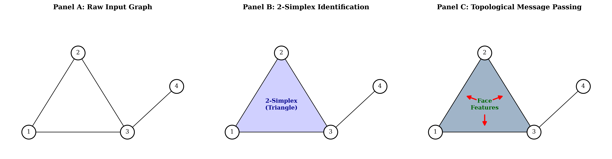
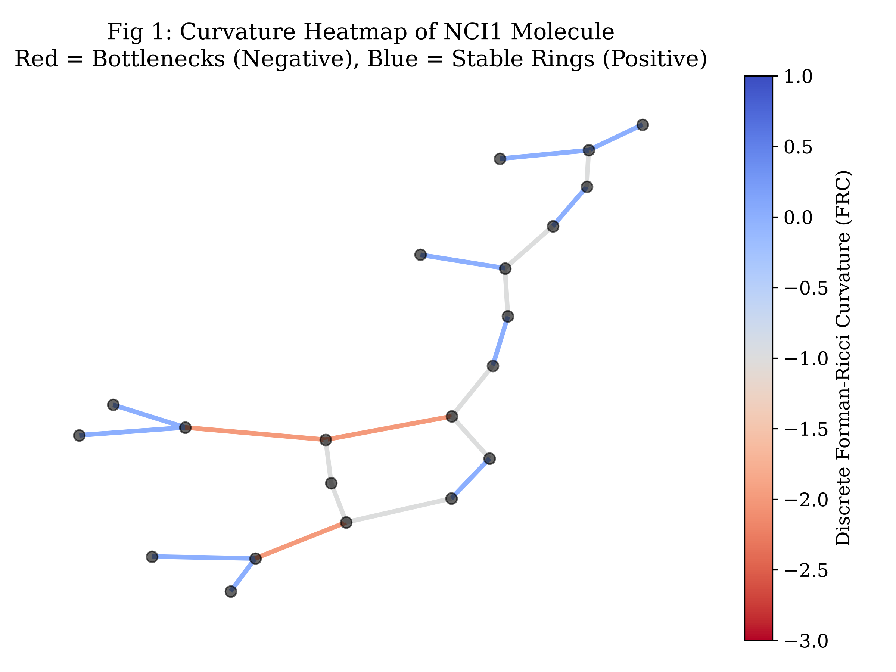
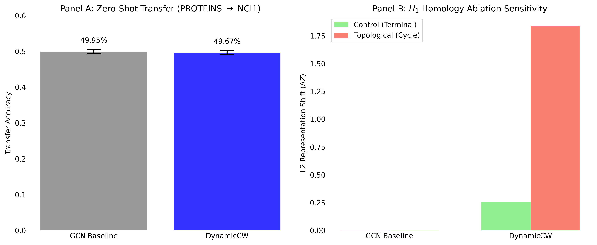
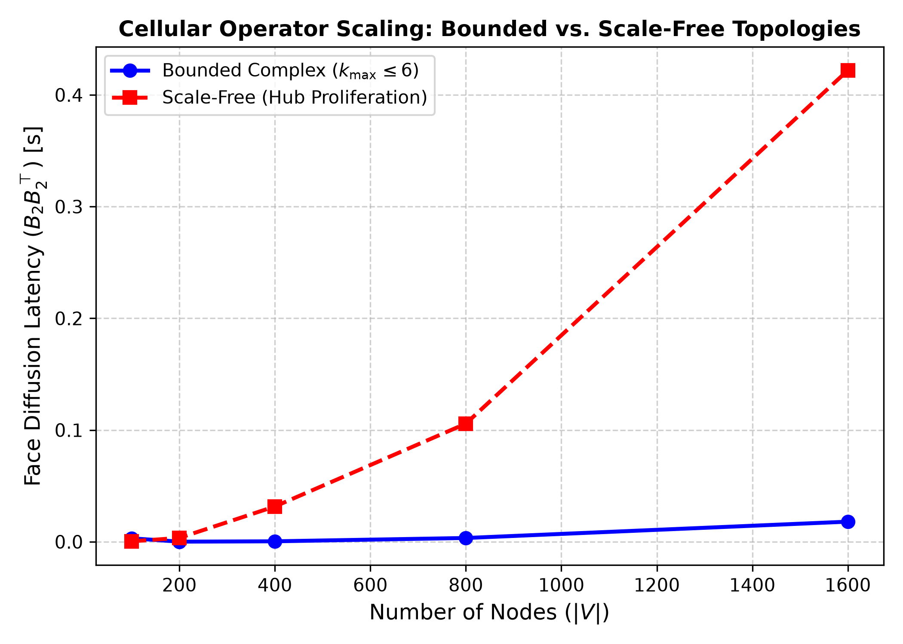

# DynamicCW: A Bochner-Weitzenböck Framework for Topologically-Motivated Graph Representation Learning

Official PyTorch implementation for **DynamicCW**, a topologically-motivated graph representation learning architecture that lifts graphs into 2-dimensional regular CW complexes and dynamically couples 0-, 1-, and 2-cells through unoriented boundary incidence matrices ($|B_1|$, $|B_2|$) and combinatorial Forman-Ricci curvature gating.

**Authors**: Aryan Padarthi, Raghav Srinivasan, Olivia Kim, Ethan Ye  
*Allen High School, Allen, TX, USA*

---

## Overview

Iterative neighborhood aggregation schemes on discrete 1D graphs are fundamentally bounded by the 1-dimensional Weisfeiler-Lehman (1-WL) isomorphism limit. Dyadic message passing cannot distinguish co-spectral strongly regular graphs, chemical rings, or dense cliques. Furthermore, negatively curved edges act as topological bottlenecks that cause severe over-squashing.

DynamicCW overcomes these limitations by:
1. **Lifting graphs to 2-dimensional CW complexes**, elevating 2-cells (faces/cycles) into first-class learning entities with continuous embeddings.
2. **Cross-dimensional message passing** via absolute boundary incidence operators $|B_1|$ and $|B_2|$, guaranteeing strict permutation equivariance.
3. **Dynamic Forman-Ricci curvature gating**, parameterizing a closed-form geometric flow that modulates topological bottlenecks in $\mathcal{O}(|E|+|F|)$ time on bounded-genus complexes ($k_{\max} = \mathcal{O}(1)$).

---

## Visual Architecture & Results

<p align="center">
  
  <br />
  <em>Figure 1: Cross-dimensional cellular message passing across 0-cells (nodes), 1-cells (edges), and 2-cells (faces).</em>
</p>

<p align="center">
  
  <br />
  <em>Figure 2: Combinatorial Forman-Ricci curvature profile on an NCI1 molecular graph isolating structural bottlenecks.</em>
</p>

<p align="center">
  
  <br />
  <em>Figure 3: (A) Zero-shot cross-domain transfer (PROTEINS &rarr; NCI1); (B) $H_1$ Homology Ablation representation shift.</em>
</p>

<p align="center">
  
  <br />
  <em>Figure 4: Empirical operator scaling on bounded complexes ($k_{\max} \le 6$) vs. unconstrained scale-free networks.</em>
</p>

---

## Repository Structure

```
DynamicCW/
├── figures/                     # High-resolution generated PNG figures
│   ├── fig1_curvature_heatmap.png
│   ├── fig3_transfer_robustness.png
│   ├── fig4_simplicial_lifting.png
│   ├── fig_scaling_benchmark.png
│   ├── bottleneck_oversquashing.png
│   └── cellular_lifting.png
├── model.py                     # CellularMessagePassingLayer & CurvatureMPSN architectures
├── model_baselines.py           # Standard GCN & Static CW network baselines
├── data_processing.py           # Chordless cycle extraction & boundary matrix construction
├── train.py                     # Model training routines, optimizers, and loss definitions
├── verify_srg_separation.py     # SRG(16,6,2,2) Betti separation verification (Theorem 2)
├── run_zinc_benchmark.py        # ZINC molecular regression & kappa=0 ablation benchmark
├── run_betti_ablation_v2.py     # H1 homology sensitivity ablation test protocol
├── run_dirichlet_energy.py      # Multi-layer Dirichlet energy decay tracker
├── run_scaling_benchmark.py     # Computational scaling & latency profiler
├── run_all_benchmarks_v2.py     # Zero-shot cross-domain evaluation (PROTEINS -> NCI1)
├── visualize_curvature.py       # Combinatorial Forman-Ricci heatmap generator
├── adversarial_utils.py         # Structural perturbation utilities
├── requirements.txt             # Python dependencies
└── README.md
```

---

## Installation

We recommend Python 3.10+ in a clean virtual environment:

```bash
python3 -m venv .venv
source .venv/bin/activate
pip install --upgrade pip
pip install -r requirements.txt
```

---

## Reproducing Paper Results & Theorems

### 1. SRG(16, 6, 2, 2) Betti-Number Separation (Theorem 2 & Proposition 1)
Evaluates the 1-WL-indistinguishable 4&times;4 Rook's graph vs. Shrikhande graph clique complexes:
```bash
python verify_srg_separation.py
```
*Expected output: Rook's $(b_0, b_1, b_2) = (1, 9, 8)$ vs. Shrikhande $(1, 2, 1)$, separated with $D \ge |E| = 48$.*

### 2. ZINC Regression & $\kappa=0$ Curvature Ablation (Section 5.3)
Runs the resource-matched 5-seed benchmark comparing Standard GCN, Static CW, DynamicCW ($\kappa=0$), and full DynamicCW:
```bash
python run_zinc_benchmark.py
```

### 3. $H_1$ Homology Sensitivity Ablation (Section 5.4)
Quantifies representation shifts under terminal edge deletion ($\Delta b_1 = 0$) versus cycle-destroying deletion ($\Delta b_1 = -1$):
```bash
python run_betti_ablation_v2.py
```
*Expected output: Standard GCN median $0.42\times$ vs. DynamicCW median $17.33\times$.*

### 4. Dirichlet Energy Collapse Tracking (Section 5.2)
Measures metric homogenization across $T=10$ propagation layers:
```bash
python run_dirichlet_energy.py
```

### 5. Empirical Latency & Scaling Profiling (Section 3.3 / 4.2)
Benchmarks boundary multiplication scaling on bounded ($k_{\max} \le 6$) vs. scale-free topologies:
```bash
python run_scaling_benchmark.py
```

### 6. Curvature Visualization
Generates the discrete Forman-Ricci curvature heatmap on molecular graphs:
```bash
python visualize_curvature.py
```

### 7. Zero-Shot Cross-Domain Generalization (Section 5.5)
Trains on `PROTEINS` and evaluates zero-shot transfer on `NCI1`:
```bash
python run_all_benchmarks_v2.py
```

---

## License

This project is licensed under the MIT License.
